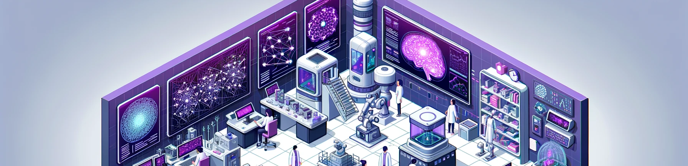

# Formación en inteligencia artificial
- 
- ## **Inteligencia artificial alucinante para mentes naturales inquietas**
- Desde 2020 seleccionamos las innovaciones más interesantes en el campo de la inteligencia artificial y te las contamos de forma entretenida y fácil de entender
- LucasCervera es promotor del proyecto [impulsar.ai](http://impulsar.ai), una plataforma que ayuda a innovadores en el campo de la inteligencia artificial a poner sus proyectos en marcha, y a entender cómo va a cambiar los distintos sectores de la actividad ([vídeos](https://www.youtube.com/@impulsarai/videos)).
- Estamos viviendo un momento único. Cada día se lanzan al mercado nuevas aplicaciones basadas en inteligencia artificial que van a cambiar la forma en que trabajamos en todos los ámbitos profesionales. Te ayudamos a conocerlas y a sacarles partido.
- ### **Para Universidades y Escuelas de Negocio**
  - Diseñamos programas e impartimos conferencias y cursos para que tus alumnos conozcan las herramientas disponibles basadas en inteligencia artificial de aplicación en diferentes ámbitos. Los estudiantes que entiendan la inteligencia artificial y aprendan a aplicarla, multiplicarán sus posibilidades de desarrollar una carrera profesional exitosa.
- #### **Conferencias**
  - Charlas para que los estudiantes conozcan el estado del arte de la inteligencia artificial. Un ejemplo es [la conferencia](https://youtu.be/j4lu36Lxvk4?t=12) que impartí para la Universidad de Tamaulipas de México , o este [resumen de varias charlas sobre startups y emprendimiento](https://www.youtube.com/watch?v=n8vGEpSRguQ&t=4s).
- #### **Cursos y clases**
  - Cursos presenciales u online en los que se exponen proyectos, se explican tendencias y herramientas en el ámbito de la inteligencia artificial, y se plantean ejercicios prácticos.
- ### **Contenidos**
  - #### **Tendencias en Inteligencia Artificial**
    - Conoce los proyectos más innovadores en el campo de la inteligencia artificial, mediante ejemplos de uso prácticos y entretenidos. Entiende qué te puede aportar hoy y en el futuro en campos como la edición de imágenes, creación de contenidos, gestión empresarial, legal, etc…
  - #### **Herramientas de inteligencia artificial generativa**
    - Conoce las herramientas que puedes utilizar para generación de texto, imágenes o vídeo. Aprende cómo usar Chat GPT, Stable Diffusion, OpenAI assistants, o botpress mediante ejercicios prácticos.
  - #### **Cómo funciona la inteligencia artificial**
    - Conoce conceptos como el prompt engineering, modelos grandes de lenguaje (LLMs), redes neuronales, embeddings, agentes de inteligencia artificial, etc…
- ## **Algunos vídeos sobre inteligencia artificial**
  - [Vídeos en formato píldora](https://innteresante.com/#/pages/ia) publicados en [Youtube](https://www.youtube.com/playlist?list=PLhKbjbKTIRcwF2FKe3MBcqj2K_mZYj88x) (+1M de visualizaciones), tiktok (150.000 seguidores) o [linkedin](https://www.linkedin.com/mynetwork/discovery-see-all/?usecase=PEOPLE_FOLLOWS&followMember=lucascervera), en el que se dan a conocer proyectos relacionados con inteligencia artificial.
  - [Entrevistas con especialistas en inteligencia artificial](https://impulsar.ai/#/pages/videos).
- ## Lucas Cervera
  
  [Lucas Cervera](sobre_mi.md#lucas ':include')